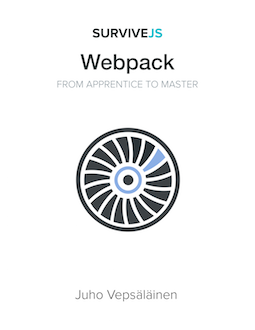

 

# SurviveJS - Webpack

> **IMPORTANT!** If you want to support the development of this book, you can [purchase a copy at Leanpub](https://leanpub.com/survivejs-webpack). A part (~30%) of the proceedings will go directly to the author of webpack to support its development.

Webpack, a module bundler, solves a significant problem for web developers. It can be daunting to learn but once you grok it, life gets easier. The purpose of this book is to make it easier to pick up the tool while learning more advanced techniques as well. You can [read the book online](http://survivejs.com/webpack/introduction/).

## How to Use This Repository?

You can read the content easily through [the book site](https://survivejs.com/webpack/introduction/). It is also available within the `manuscript` directory of the repository.

Please note that the repository defaults to the `dev` branch of the book. `master` contains the source of the most recent version. Each version has been tagged so that it's easy for you to find the source matching to the version of the book you are reading.

## Getting Support

As no book is perfect, you will likely come by issues and might have some questions related to the content. There are a couple of options to deal with this:

* Contact me through [GitHub Issue Tracker](https://github.com/survivejs/webpack/issues)
* Join me at [Gitter Chat](https://gitter.im/survivejs/webpack)
* Follow [@survivejs](https://twitter.com/survivejs) at Twitter for official news or poke me through [@bebraw](https://twitter.com/bebraw) directly
* Send me email at [info@survivejs.com](mailto:info@survivejs.com)
* Ask me anything about webpack or React at [SurviveJS AmA](https://github.com/survivejs/ama/issues)

If you post questions to [Stack Overflow](https://stackoverflow.com/search?q=survivejs), tag them using [**survivejs**](https://stackoverflow.com/questions/tagged/survivejs) so I will get notified of them. You can also use the hashtag [**#survivejs**](https://twitter.com/hashtag/survivejs?src=hash) at Twitter.

## Announcements

I announce SurviveJS related news through a couple of channels:

* [Mailing list](https://eepurl.com/bth1v5)
* [Twitter](https://twitter.com/survivejs)
* [Blog RSS](https://survivejs.com/atom.xml)

Feel free to subscribe.

## Contributing

Feedback and PRs are welcome! See [*CONTRIBUTING.md*](CONTRIBUTING.md) for more information.

## License

