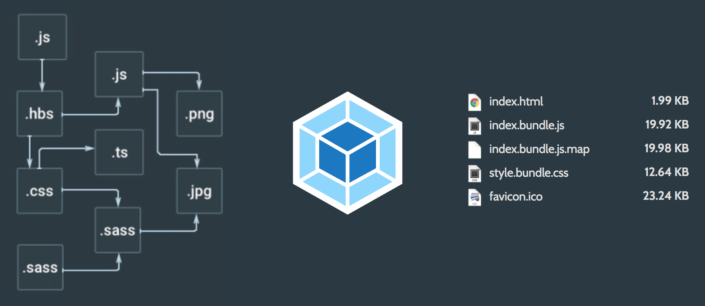

# Webpack Compared

You can understand better why Webpack's approach is powerful by putting it into a historical context. Back in the day, it was enough just to concatenate some scripts together. Times have changed, though, and now distributing your JavaScript code can be a complex endeavor.

This problem has escalated with the rise of single page applications (SPAs). They tend to rely on numerous hefty libraries. There are multiple strategies on how to deal with loading them. You could load them all at once. You could also consider loading libraries as you need them. These are examples of strategies you can apply, and Webpack supports many of them.

The popularity of Node.js and [npm](https://www.npmjs.com/), the Node.js package manager, provides more context. Before npm it was difficult to consume dependencies. Now that npm has become popular for front-end development, the situation has changed. Dependency management is far easier than earlier.

## Task Runners and Bundlers

Historically speaking, there have been many build systems. Make is perhaps the best known, and is still a viable option. To make things easier, specialized *task runners*, such as Grunt, and Gulp appeared. Plugins available through npm made both task runners powerful.

Task runners are great tools on a high level. They allow you to perform operations in a cross-platform manner. The problems begin when you need to splice various assets together and produce bundles. This is the reason we have *bundlers*, such as Browserify, Brunch, or Webpack.

Continuing further on this path, [JSPM](http://jspm.io/) pushes package management directly to the browser. It relies on [System.js](https://github.com/systemjs/systemjs), a dynamic module loader. Webpack 2 will support System.js semantics as well.

Unlike Browserify, Brunch, and Webpack, JSPM skips the bundling step altogether during development. You can generate a production bundle using it, however. Glen Maddern goes into good detail at his [video about JSPM](https://www.youtube.com/watch?t=33&v=iukBMY4apvI).

## Make

You could say [Make](https://en.wikipedia.org/wiki/Make_%28software%29) goes way back. It was initially released in 1977. Even though it's an old tool, it has remained relevant. Make allows you to write separate tasks for various purposes. For instance, you might have separate tasks for creating a production build, minifying your JavaScript or running tests. You can find the same idea in many other tools.

Even though Make is mostly used with C projects, it's not tied to it in any way. James Coglan discusses in detail [how to use Make with JavaScript](https://blog.jcoglan.com/2014/02/05/building-javascript-projects-with-make/). Consider the abbreviated code based on James' post below:

**Makefile**

```makefile
PATH  := node_modules/.bin:$(PATH)
SHELL := /bin/bash

source_files := $(wildcard lib/*.coffee)
build_files  := $(source_files:%.coffee=build/%.js)
app_bundle   := build/app.js
spec_coffee  := $(wildcard spec/*.coffee)
spec_js      := $(spec_coffee:%.coffee=build/%.js)

libraries    := vendor/jquery.js

.PHONY: all clean test

all: $(app_bundle)

build/%.js: %.coffee
    coffee -co $(dir $@) $<

$(app_bundle): $(libraries) $(build_files)
    uglifyjs -cmo $@ $^

test: $(app_bundle) $(spec_js)
    phantomjs phantom.js

clean:
    rm -rf build
```

With Make, you model your tasks using Make-specific syntax and terminal commands. This allows it to integrate easily with Webpack.

## Grunt


[Grunt](http://gruntjs.com/) went mainstream before Gulp. Its plugin architecture, especially, contributed towards its popularity. Often plugins are complex by themselves. As a result when configuration grows, it can become difficult to understand what's going on.

Here's an example from [Grunt documentation](http://gruntjs.com/sample-gruntfile). In this configuration, we define a linting and a watcher task. When the *watch* task is run, it will trigger the *lint* task as well. This way, as we run Grunt, we'll get warnings in real-time in our terminal as we edit our source code.

**Gruntfile.js**

```javascript
module.exports = function(grunt) {
  grunt.initConfig({
    lint: {
      files: ['Gruntfile.js', 'src/**/*.js', 'test/**/*.js'],
      options: {
        globals: {
          jQuery: true
        }
      }
    },
    watch: {
      files: ['<%= lint.files %>'],
      tasks: ['lint']
    }
  });

  grunt.loadNpmTasks('grunt-contrib-jshint');
  grunt.loadNpmTasks('grunt-contrib-watch');

  grunt.registerTask('default', ['lint']);
};
```

In practice, you would have many small tasks like this for various purposes, such as building the project. An important part of the power of Grunt is that it hides a lot of the wiring from you. Taken too far, this can get problematic, though. It can become hard to thoroughly understand what's going on under the hood.

T> Note that the [grunt-webpack](https://www.npmjs.com/package/grunt-webpack) plugin allows you to use Webpack in a Grunt environment. You can leave the heavy lifting to Webpack.

## Gulp


[Gulp](http://gulpjs.com/) takes a different approach. Instead of relying on configuration per plugin, you deal with actual code. Gulp builds on top of the concept of piping. If you are familiar with Unix, it's the same idea here. You simply have sources, filters, and sinks.

Sources match to files. Filters perform operations on sources (e.g., convert to JavaScript). Finally, the results get passed to sinks (e.g., your build directory). Here's a sample *Gulpfile* to give you a better idea of the approach, taken from the project's README. It has been abbreviated a bit:

**Gulpfile.js**

```javascript
var gulp = require('gulp');
var coffee = require('gulp-coffee');
var concat = require('gulp-concat');
var uglify = require('gulp-uglify');
var sourcemaps = require('gulp-sourcemaps');
var del = require('del');

var paths = {
    scripts: ['client/js/**/*.coffee', '!client/external/**/*.coffee']
};

// Not all tasks need to use streams
// A gulpfile is just another node program
// and you can use all packages available on npm
gulp.task('clean', function(cb) {
  // You can use multiple globbing patterns as
  // you would with `gulp.src`
  del(['build'], cb);
});

gulp.task('scripts', ['clean'], function() {
  // Minify and copy all JavaScript (except vendor scripts)
  // with sourcemaps all the way down
  return gulp.src(paths.scripts)
    .pipe(sourcemaps.init())
      .pipe(coffee())
      .pipe(uglify())
      .pipe(concat('all.min.js'))
    .pipe(sourcemaps.write())
    .pipe(gulp.dest('build/js'));
});

// Rerun the task when a file changes
gulp.task('watch', function() {
  gulp.watch(paths.scripts, ['scripts']);
});

// The default task (called when you run `gulp` from CLI)
gulp.task('default', ['watch', 'scripts']);
```

Given the configuration is code, you can always just hack it if you run into troubles. You can wrap existing Node.js packages as Gulp plugins, and so on. Compared to Grunt, you have a clearer idea of what's going on. You still end up writing a lot of boilerplate for casual tasks, though. That is where some newer approaches come in.

T> [gulp-webpack](https://www.npmjs.com/package/gulp-webpack) allows you to use Webpack in a Gulp environment.

T> [Fly](https://github.com/bucaran/fly) is a similar tool as Gulp. It relies on ES6 generators instead.

## Browserify


Dealing with JavaScript modules has always been a bit of a problem. The language itself actually didn't have the concept of modules till ES6. Ergo, we have been stuck in the '90s when it comes to browser environments. Various solutions, including [AMD](http://requirejs.org/docs/whyamd.html), have been proposed.

In practice, it can be useful just to use CommonJS, the Node.js format, and let the tooling deal with the rest. The advantage is that you can often hook into npm and avoid reinventing the wheel.

[Browserify](http://browserify.org/) is one solution to the module problem. It provides a way to bundle CommonJS modules together. You can hook it up with Gulp. There are smaller transformation tools that allow you to move beyond the basic usage. For example, [watchify](https://www.npmjs.com/package/watchify) provides a file watcher that creates bundles for you during development. This will save some effort and no doubt is a good solution up to a point.

The Browserify ecosystem is composed of a lot of small modules. In this way, Browserify adheres to the Unix philosophy. Browserify is a little easier to adopt than Webpack, and is, in fact, a good alternative to it.

## Brunch


Compared to Gulp, [Brunch](http://brunch.io/) operates on a higher level of abstraction. It uses a declarative approach similar to Webpack's. To give you an example, consider the following configuration adapted from the Brunch site:

```javascript
module.exports = {
  files: {
    javascripts: {
      joinTo: {
        'vendor.js': /^(?!app)/,
        'app.js': /^app/
      }
    },
    stylesheets: {
      joinTo: 'app.css'
    }
  },
  plugins: {
    babel: {
      presets: ['es2015', 'react']
    },
    postcss: {
      processors: [require('autoprefixer')]
    }
  }
};
```

Brunch comes with commands like `brunch new`, `brunch watch --server`, and `brunch build --production`. It contains a lot out of box and can be extended using plugins.

T> There is an experimental [Hot Module Reloading runtime](https://github.com/brunch/hmr-brunch) for Brunch.

## JSPM


Using JSPM is quite different than earlier tools. It comes with a little CLI tool of its own that is used to install new packages to the project, create a production bundle, and so on. It supports [SystemJS plugins](https://github.com/systemjs/systemjs#plugins) that allow you to load various formats to your project.

Given JSPM is still a young project, there might be rough spots. That said, it may be worth a look if you are adventurous. As you know by now, tooling tends to change quite often in front-end development, and JSPM is definitely a worthy contender.

## Webpack



You could say [Webpack](https://webpack.github.io/) takes a more monolithic approach than Browserify. Whereas Browserify consists of multiple small tools, Webpack comes with a core that provides a lot of functionality out of the box. The core can be extended using specific *loaders* and *plugins*.

Webpack will traverse through the `require` statements of your project and will generate the bundles you have defined. The loader mechanism works for CSS as well and `@import` is supported. There are also plugins for specific tasks, such as minification, localization, hot loading, and so on.

To give you an example, `require('style!css!./main.css')` loads the contents of *main.css* and processes it through CSS and style loaders from right to left. Given that this kind of declarations tie the source code to Webpack, it is preferable to set up the loaders at Webpack configuration. Here is a sample configuration adapted from [the official webpack tutorial](http://webpack.github.io/docs/tutorials/getting-started/):

**webpack.config.js**

```javascript
var webpack = require('webpack');

module.exports = {
  entry: './entry.js',
  output: {
    path: __dirname,
    filename: 'bundle.js'
  },
  module: {
    loaders: [
      {
        test: /\.css$/,
        loaders: ['style', 'css']
      }
    ]
  },
  plugins: [
    new webpack.optimize.UglifyJsPlugin()
  ]
};
```

Given the configuration is written in JavaScript, it's quite malleable. As long as it's JavaScript, Webpack is fine with it.

The configuration model may make Webpack feel a bit opaque at times. It can be difficult to understand what it's doing. This is particularly true for more complicated cases. Covering those is one of the main reasons why this book exists.

## Why Webpack?

Why would you use Webpack over tools like Gulp or Grunt? It's not an either-or proposition. Webpack deals with the difficult problem of bundling, but there's so much more. I picked up Webpack because of its support for **Hot Module Replacement** (HMR). This is a feature used by [babel-plugin-react-transform](https://github.com/gaearon/babel-plugin-react-transform). I will show you later how to set it up.

### Hot Module Replacement

You might be familiar with tools, such as [LiveReload](http://livereload.com/) or [Browsersync](http://www.browsersync.io/), already. These tools refresh the browser automatically as you make changes. HMR takes things one step further. In the case of React, it allows the application to maintain its state. This sounds simple, but it makes a big difference in practice.

Note that HMR is available in Browserify via [livereactload](https://github.com/milankinen/livereactload), so it's not a feature that's exclusive to Webpack.

### Bundle Splitting

Aside from the HMR feature, Webpack's bundling capabilities are extensive. It allows you to split bundles in various ways. You can even load them dynamically as your application gets executed. This sort of lazy loading comes in handy, especially for larger applications. You can load dependencies as you need them.

### Asset Hashing

With Webpack, you can easily inject a hash to each bundle name (e.g., *app.d587bbd6e38337f5accd.js*). This allows you to invalidate bundles on the client side as changes are made. Bundle splitting allows the client to reload only a small part of the data in the ideal case.

### Loaders and Plugins

All these smaller features add up. Surprisingly, you can get many things done out of the box. And if you are missing something, there are loaders and plugins available that allow you to go further.

Webpack comes with a significant learning curve. Even still, it's a tool worth learning, given it saves so much time and effort over the long term. To get a better idea how it compares to some other tools, check out [the official comparison](https://webpack.github.io/docs/comparison.html).

## Conclusion

I hope this chapter helped you understand why Webpack is a valuable tool worth learning. It solves a fair share of common web development problems. If you know it well, it will save a great deal of time.

In the following chapters we'll examine Webpack in more detail. You will learn to develop a basic development and build configuration. The later chapters delve into more advanced topics.

You can use Webpack with some other tools. It won't solve everything. It does solve the difficult problem of bundling, however. That's one less worry during development. Just using *package.json*, `scripts`, and Webpack takes you far, as we will see soon.
