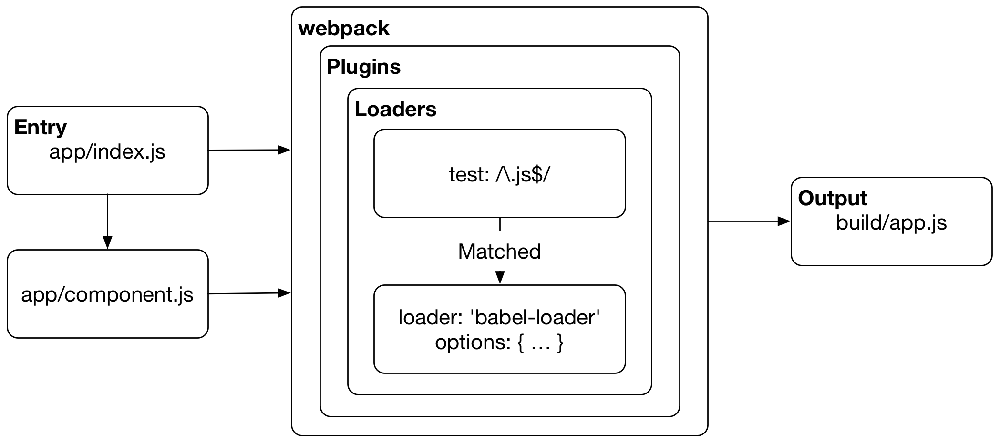

# What is Webpack

Webpack is a **module bundler**. Webpack can take care of bundling alongside a separate task runner. However, the line between bundler and task runner has become blurred thanks to community developed webpack plugins. Sometimes these plugins are used to perform tasks that are usually done outside of webpack, such as cleaning the build directory or deploying the build.

React, and **Hot Module Replacement** (HMR) helped to popularize webpack and led to its usage in other environments, such as [Ruby on Rails](https://github.com/rails/webpacker). Despite its name, webpack is not limited to the web alone. It can bundle with other targets as well, as discussed in the *Build Targets* chapter.

T> If you want to understand build tools and their history in better detail, check out the *Comparison of Build Tools* appendix.

## Webpack Relies on Modules

The smallest project you can bundle with webpack consists of **input** and **output**. The bundling process begins from user-defined **entries**. Entries themselves are **modules** and can point to other modules through **imports**.

When you bundle a project using webpack, it traverses the imports, constructing a **dependency graph** of the project and then generates **output** based on the configuration. Additionally, it's possible to define **split points** to create separate bundles within the project code itself.

Webpack supports ES2015, CommonJS, and AMD module formats out of the box. The loader mechanism works for CSS as well, with `@import` and `url()` support through *css-loader*. You can also find plugins for specific tasks, such as minification, internationalization, HMR, and so on.

T> A dependency graph is a directed graph that describes how nodes relate to each other. In this case, the graph definition is defined through references (`require`, `import`) between files. Webpack statically traverses these without executing the source to generate the graph it needs to create bundles.

## Webpack's Execution Process



Webpack begins its work from **entries**. Often these are JavaScript modules where webpack begins its traversal process. During this process, webpack evaluates entry matches against **loader** configurations that tell webpack how to transform each match.

{pagebreak}

### Resolution Process

An entry itself is a module. When webpack encounters one, webpack tries to match the entry against the file system using the entry's `resolve` configuration. You can tell webpack to perform the lookup against specific directories in addition to *node_modules*. It's also possible to adjust the way webpack matches against file extensions, and you can define specific aliases for directories. The *Consuming Packages* chapter covers these ideas in greater detail.

If the resolution pass failed, webpack raises a runtime error. If webpack managed to resolve a file correctly, webpack performs processing over the matched file based on the loader definition. Each loader applies a specific transformation against the module contents.

The way a loader gets matched against a resolved file can be configured in multiple ways, including by file type and by location within the file system. Webpack's flexibility even allows you to apply a specific transformation to a file based on *where* it was imported into the project.

The same resolution process is performed against webpack's loaders. Webpack allows you to apply similar logic when determining which loader it should use. Loaders have resolve configurations of their own for this reason. If webpack fails to perform a loader lookup, it will raise a runtime error.

T> To resolve, webpack relies on [enhanced-resolve](https://www.npmjs.com/package/enhanced-resolve) package underneath.

### Webpack Resolves Against Any File Type

Webpack will resolve each module it encounters while constructing the dependency graph. If an entry contains dependencies, the process will be performed recursively against each dependency until the traversal has completed. Webpack can perform this process against any file type, unlike specialized tools like the Babel or Sass compiler.

Webpack gives you control over how to treat different assets it encounters. For example, you can decide to **inline** assets to your JavaScript bundles to avoid requests. Webpack also allows you to use techniques like CSS Modules to couple styling with components, and to avoid issues of standard CSS styling. This flexibility is what makes webpack so valuable.

Although webpack is used mainly to bundle JavaScript, it can capture assets like images or fonts and emit separate files for them. Entries are only a starting point of the bundling process. What webpack emits depends entirely on the way you configure it.

### Evaluation Process

Assuming all loaders were found, webpack evaluates the matched loaders from bottom to top and right to left (`styleLoader(cssLoader('./main.css'))`) while running the module through each loader in turn. As a result, you get output which webpack will inject in the resulting **bundle**. The *Loader Definitions* chapter covers the topic in detail.

If all loader evaluation completed without a runtime error, webpack includes the source in the last bundle. **Plugins** allow you to intercept **runtime events** at different stages of the bundling process.

Although loaders can do a lot, they don’t provide enough power for advanced tasks. Plugins can intercept **runtime events** supplied by webpack. A good example is bundle extraction performed by the `MiniCssExtractPlugin` which, when used with a loader, extracts CSS files out of the bundle and into a separate file. Without this step, CSS would be inlined in the resulting JavaScript, as webpack treats all code as JavaScript by default. The extraction idea is discussed in the *Separating CSS* chapter.

### Finishing

After every module has been evaluated, webpack writes **output**. The output includes a bootstrap script with a manifest that describes how to begin executing the result in the browser. The manifest can be extracted to a file of its own, as discussed later in the book. The output differs based on the build target you are using (targeting web is not the only option).

That’s not all there is to the bundling process. For example, you can define specific **split points** where webpack generates separate bundles that are loaded based on application logic. This idea is discussed in the *Code Splitting* chapter.

## Webpack Is Configuration Driven

At its core, webpack relies on configuration. Here is a sample configuration adapted from [the official webpack tutorial](https://webpack.js.org/get-started/) that covers the main points:

**webpack.config.js**

```javascript
const webpack = require("webpack");

module.exports = {
  // Where to start bundling
  entry: {
    app: "./entry.js",
  },

  // Where to output
  output: {
    // Output to the same directory
    path: __dirname,

    // Capture name from the entry using a pattern
    filename: "[name].js",
  },

  // How to resolve encountered imports
  module: {
    rules: [
      {
        test: /\.css$/,
        use: ["style-loader", "css-loader"],
      },
      {
        test: /\.js$/,
        use: "babel-loader",
        exclude: /node_modules/,
      },
    ],
  },

  // What extra processing to perform
  plugins: [
    new webpack.DefinePlugin({ ... }),
  ],

  // Adjust module resolution algorithm
  resolve: {
    alias: { ... },
  },
};
```

Webpack's configuration model can feel a bit opaque at times as the configuration file can appear monolithic. It can be difficult to understand what webpack is doing unless you know the ideas behind it. Providing means to tame configuration is one of the primary purposes why this book exists.

## Asset Hashing

With webpack, you can inject a hash to each bundle name (e.g., *app.d587bbd6.js*) to invalidate bundles on the client side as changes are made. Bundle-splitting allows the client to reload only a small part of the data in the ideal case.

## Hot Module Replacement

You are likely familiar with tools, such as [LiveReload](http://livereload.com/) or [BrowserSync](http://www.browsersync.io/), already. These tools refresh the browser automatically as you make changes. *Hot Module Replacement* (HMR) takes things one step further. In the case of React, it allows the application to maintain its state without forcing a refresh. While this does not sound all that special, it can make a big difference in practice.

HMR is also available in Browserify via [livereactload](https://github.com/milankinen/livereactload), so it’s not a webpack exclusive feature.

## Code Splitting

In addition to HMR, webpack’s bundling capabilities are extensive. Webpack allows you to split code in various ways. You can even load code dynamically as your application gets executed. This sort of lazy loading comes in handy especially for broader applications, as dependencies can be loaded on the fly as needed.

Even small applications can benefit from code splitting, as it allows the users to get something usable in their hands faster. Performance is a feature, after all. Knowing the basic techniques is worthwhile.

## Conclusion

Webpack comes with a significant learning curve. However, it’s a tool worth learning, given how much time and effort it can save over the long term. To get a better idea how it compares to other tools, check out [the official comparison](https://webpack.js.org/comparison/).

Webpack won’t solve everything. However, it does solve the problem of bundling. That’s one less worry during development. Using *package.json* and webpack alone can take you far.

To summarize:

* Webpack is a **module bundler**, but you can also use it running  tasks as well.
* Webpack relies on a **dependency graph** underneath. Webpack traverses through the source to construct the graph, and it uses this information and configuration to generate bundles.
* Webpack relies on **loaders** and **plugins**. Loaders operate on a module level, while plugins rely on hooks provided by webpack and have the best access to its execution process.
* Webpack’s **configuration** describes how to transform assets of the graphs and what kind of output it should generate. Part of this information can be included in the source itself if features like **code splitting** are used.
* **Hot Module Replacement** (HMR) helped to popularize webpack. It's a feature that can enhance the development experience by updating code in the browser without needing a full page refresh.
* Webpack can generate **hashes** for filenames allowing you to invalidate past bundles as their contents change.

In the next part of the book, you'll learn to construct a development configuration using webpack while learning more about its basic concepts.

T> If you are still unsure of webpack or why bundlers are required, read [Why would I use a Webpack?](http://tinselcity.net/whys/packers).
